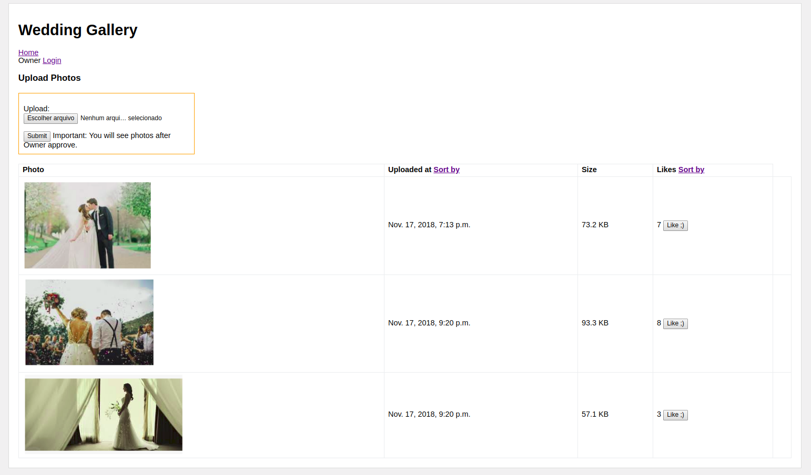
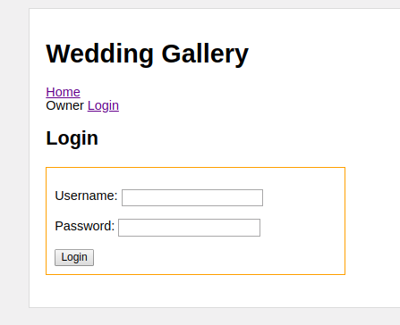
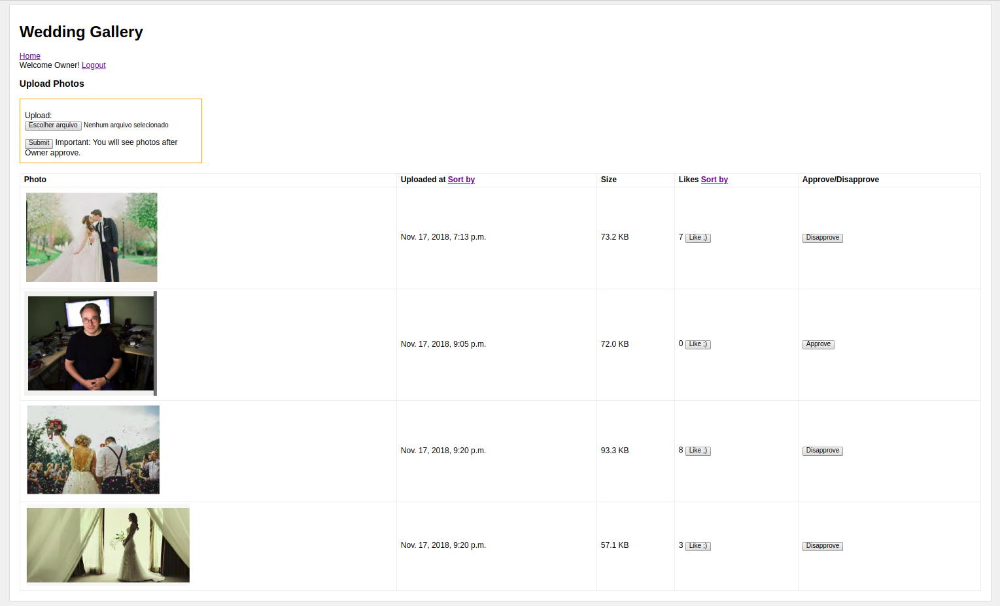

# Wedding Gallery [](https://circleci.com/gh/josepedro/wedding-gallery/tree/master)

This problem can be composed by following User Stories:

- **US 1**: As site's owner, I want to allow my friends uploading photos because I want to see and store these photos; Acceptance Criteria: site's owner have to see a list of photos. **[DONE]**

- **US 2**: As site's owner, I want to controll the visibility of photos because I want to show seletected photos; 
Acceptance Criteria: site's owner have to approve and disapprove photos and site's visitors will see only approved photos. **[DONE]**

- **US 3**: As site's owner, I want to permit visitors to like photos because I want to see the more liked photos; 
Acceptance Criteria: visitors have to see the number of "likes" on each photo on gallery. **[DONE]**

- **US 4**: As visitor, I want to sort photos by total of likes because I want to see the most liked photos as initials elements; 
Acceptance Criteria: visitors have to see a list of sorted photos by total of likes, the top element will be with more likes. **[DONE]**

- **US 5**: As visitor, I want to sort photos by date of upload because I want to see the most novels photos as initials elements; 
Acceptance Criteria: visitors have to see a list of sorted photos by date of upload, the top element will be with more new. **[DONE]**

## Development Mode

We have to do following steps to developer mode:

- ```git clone https://github.com/josepedro/wedding-gallery.git && cd wedding-gallery```

- ```pip install virtualenv```

- ```virtualenv . -p /usr/bin/python2.7```

- ```source bin/activate```

- ```pip install -r requirements.txt```

- ```python manage.py makemigrations```

- ```python manage.py migrate```

- ```python manage.py collectstatic```

- ```python manage.py runserver```

## Tests

All acceptance criterias are covered by tests in weddingggallery/core/tests.py module and can be run by using:

- ```python manage.py test weddinggallery```

In order to achieve the high quality standards for the production environment, CircleCi was apllied.

## Deploy

First you have to install docker by following this link if you use ubuntu:

- https://docs.docker.com/install/linux/docker-ce/ubuntu

After to deploy:

- ```docker run -d -p 80:8000 -it josepedro/weddinggallery```

The app will start a server on port 80. 

Also, you can see this application deployed at:

- http://ec2-18-234-37-217.compute-1.amazonaws.com

## Using Wedding Gallery Application

### Home Screen as Visitor

As visitor, you will see only photos that were approved by site's owner login (groom and bride access). 
You can upload images but you have to wait groom or bride to approve. 
As well, you can sort photos by like's number or date's upload by pressing "Upload at Sort by" or "Likes Sort by".
Feel free to like photos ;)



### Owner Login

If you are groom or bride, you can login as owner with Username and Password like:

- Username: owner

- Password: owner  



### Home Screen as Owner

As Owner, you will buttons to approve or disapprove photos.
In this case, the photo of Linus is disapprove. But, if groom or bride likes Linus, they can approve this photo.  



## Project's Design

This project is based on [Django](https://www.djangoproject.com/). For more informations about dependencies, you can see [requirements.txt](https://raw.githubusercontent.com/josepedro/wedding-gallery/master/requirements.txt) file.

The main structure of Django App is: 

```bash
weddinggallery/core/
├── admin.py
├── apps.py
├── __init__.py
├── migrations
├── models.py
├── templates
├── tests.py
└── views.py
```

The architectural pattern of Django is MTV like:

* Model: here we have all models declared in ```models.py```. The principal model is Photo that have the following attributes: 

	* ```id``` -> Primary key; 

	* ```uploaded_at``` -> Date of upload automatically generated; 

	* ```upload``` -> ```FileField``` object that references url on S3;

	* ```status``` -> ```String``` Approve or Disapprove;

	* ```likes``` -> ```Integer``` with number of likes.

* Views: here we have all functions to controll the application (can be seen as controller); 

* Templates: here we have all HTMLs to render.  

## Performance Test

With [vegeta](https://github.com/tsenart/vegeta) tool we can test the performance of Wedding Gallery by sending GET requests on root of http://ec2-18-234-37-217.compute-1.amazonaws.com. Next we can see some results:

* Total of requests in 4 seconds: 200 requests

* Latencies per request: 5.020514026 seconds

* Total Bytes In: 1470000

* Success Ratio: 100.00%

Other results with more access:

* Total of requests in 2 minutes: 5000 requests

* Latencies per request: 22.411604699s seconds

* Total Bytes In: 16368450

* Success Ratio: 44.54%

